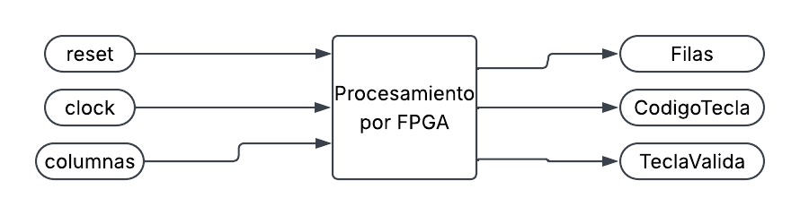

# Controlador de Teclado Matricial 4x4 mediante ASM

Este repositorio contiene la documentación técnica, el diseño y la solución del laboratorio **Diseño de un Controlador mediante Máquina de Estado Algorítmica (ASM)**. El proyecto consiste en el diseño de un periférico de hardware que actúa como el controlador de entrada de una caja fuerte digital: explora un teclado matricial de 4x4, detecta la tecla pulsada y entrega su código acompañado de un pulso de validación de un solo ciclo de reloj, garantizando **un pulso por pulsación** sin importar cuánto tiempo se mantenga presionada la tecla.

El proyecto está estructurado bajo tres dominios fundamentales del diseño electrónico: **Comportamental**, **Estructural** y **Físico**.

---

## 1. Dominio Comportamental

Este dominio define *qué* hace el sistema, sus interfaces y su lógica de control algorítmica, sin entrar en detalles de la implementación del hardware interno.

### Diagrama de Caja Negra

Establece las fronteras del sistema, definiendo claramente las señales de entrada (estímulos y sensores) y las señales de salida (actuadores e indicadores).

* **Entradas:** Reloj maestro (`clk`) de la tarjeta FPGA, reset asíncrono (`rst`) y el bus de las cuatro líneas de columna del teclado (`columnas[3:0]`, activas en bajo con resistencia de pull-up).
* **Salidas:** Bus de exploración de las cuatro líneas de fila (`filas[3:0]`, activas en bajo, con una sola línea en `0` a la vez), el código binario de la tecla detectada (`codigoTecla[3:0]`) y la señal de validación (`teclaValida`).




### Diagrama de Flujo (ASM)

Describe el algoritmo de toma de decisiones y las prioridades del sistema:

1.  **Prioridad 1 (Activación de Fila):** En el estado `S_ACTIVA` el controlador coloca en bajo una única línea de fila, determinada por el registro `filaActual`, y limpia el acumulador de permanencia.
2.  **Prioridad 2 (Estabilización y Antirrebote):** En el estado `S_ESPERA` el acumulador incrementa con cada flanco ascendente de la señal maestra. Al alcanzar el límite establecido por el parámetro `PASO`, genera la condición de habilitación `finPaso` y permite el muestreo. Este intervalo cumple la doble función de estabilizar las líneas y filtrar el rebote mecánico del contacto.
3.  **Prioridad 3 (Muestreo y Decisión):** En el estado `S_LEE` se evalúa el decodificador combinacional. Si la condición `hayTecla` es verdadera y el enclavamiento `sostenida` está limpio, se ejecuta la acción condicional: se carga `codigoTecla`, se emite `teclaValida` durante un único ciclo y se activa el enclavamiento para impedir la repetición. Si no se detecta tecla, se propaga el control hacia el avance de fila.
4.  **Prioridad 4 (Avance del Barrido):** En el estado `S_AVANZA` el registro `filaActual` incrementa y el control retorna al estado inicial, cerrando el barrido cíclico sobre las cuatro filas.

El enclavamiento `sostenida` se limpia exclusivamente cuando la condición `libreCols` indica que todas las columnas retornaron a nivel alto, lo que materializa el requisito de un pulso por pulsación.


### Ecuaciones Booleanas

Define la lógica combinacional exacta que rige el sistema. Las condiciones de decisión de la ASM (los rombos del diagrama) responden a las siguientes expresiones, en función del acumulador de permanencia, el decodificador de tecla y las líneas de columna ($c_3, c_2, c_1, c_0$):

* $finPaso = (contador \geq PASO - 1)$
* $hayTecla = \overline{(teclaLeida = \text{F}_{16})}$
* $libreCols = c_3 \land c_2 \land c_1 \land c_0$
* $reportar = hayTecla \land \overline{sostenida}$

Las ecuaciones de transición de estado, con el estado codificado en dos bits ($E_1, E_0$), quedan determinadas por:

* $S\_ACTIVA \rightarrow S\_ESPERA = 1$ (transición incondicional)
* $S\_ESPERA \rightarrow S\_LEE = finPaso$
* $S\_ESPERA \rightarrow S\_ESPERA = \overline{finPaso}$
* $S\_LEE \rightarrow S\_ESPERA = hayTecla$
* $S\_LEE \rightarrow S\_AVANZA = \overline{hayTecla}$
* $S\_AVANZA \rightarrow S\_ACTIVA = 1$ (transición incondicional)

El decodificador de tecla constituye una tabla de verdad de seis entradas (dos bits de fila y cuatro de columna) hacia cuatro salidas. Dada su extensión, se describe mediante una estructura `case` sintetizada como matriz lógica multiplexada, en lugar de mapas de simplificación individuales.

## Diccionario de Señales (Entradas / Salidas)

| Tipo | Variable Lógica | Etiqueta Física | Descripción |
| :--- | :---: | :---: | :--- |
| **Entrada** | `clk` | `clk` | Señal de reloj maestro de la placa FPGA (50 MHz) |
| **Entrada** | `rst` | `rst` | Señal de reinicio asíncrono, activa en alto |
| **Entrada** | `columnas` | `columnas[3:0]` | Bus de entrada desde las columnas del teclado (activas en bajo) |
| **Salida** | `filas` | `filas[3:0]` | Bus de exploración hacia las filas del teclado (activas en bajo) |
| **Salida** | `codigoTecla` | `codigoTecla[3:0]` | Bus con el código de la tecla: 0-9 dígitos, 10-13 letras A-D, 14 asterisco, 15 numeral |
| **Salida** | `teclaValida` | `teclaValida` | Pulso de validación de un ciclo ante una pulsación nueva |
| **Interna** | `estado` | `estado[1:0]` | Registro de estado de la máquina algorítmica |
| **Interna** | `proxEstado` | `proxEstado[1:0]` | Red combinacional del estado siguiente |
| **Interna** | `filaActual` | `filaActual[1:0]` | Registro índice de la fila bajo exploración |
| **Interna** | `contador` | `contador[15:0]` | Registro acumulador de permanencia y antirrebote |
| **Interna** | `sostenida` | `sostenida` | Biestable de enclavamiento de pulsación reportada |
| **Interna** | `teclaLeida` | `teclaLeida[3:0]` | Salida combinacional del decodificador de tecla |

### Descripción en Lenguaje de Hardware (Verilog)

A partir de las ecuaciones obtenidas, el comportamiento del sistema se describe utilizando el lenguaje de descripción de hardware Verilog. Este código es el que define la lógica que posteriormente será sintetizada en la FPGA:

```verilog
//==============================================================================
//  TecladoMatricial  --  Controlador de barrido de teclado 4x4
//------------------------------------------------------------------------------

//  ENTRADAS
//    clk        : reloj del sistema (50 MHz en la FPGA)
//    rst        : reset asincrono, activo en alto
//    columnas   : 4 lineas de columna, activas en bajo (pull-up externo)
//
//  SALIDAS
//    filas       : 4 lineas de fila, activas en bajo (una sola en 0)
//    codigoTecla : 0-9 digitos, 10-13 = A..D, 14 = '*', 15 = '#'
//    teclaValida : pulso de 1 ciclo cuando se detecta una tecla NUEVA
//
//  RESTRICCIONES
//    - Solo se garantiza la lectura de UNA tecla a la vez.
//    - El tiempo de permanencia por fila (PASO) hace de antirrebote:
//      en la FPGA vale 50_000 ciclos = 1 ms; el testbench lo reduce.
//    - Salidas registradas: no hay caminos combinacionales de entrada a
//      salida (evita glitches).

//==============================================================================
module top #(
    parameter PASO = 50_000     // ciclos por fila (1 ms @50MHz). TB: usar 4
)(
    input  wire       clk,
    input  wire       rst,
    input  wire [3:0] columnas,      // activa-baja
    output reg  [3:0] filas,         // activa-baja
    output reg  [3:0] codigoTecla,
    output reg        teclaValida    // pulso de 1 ciclo
);

    //--------------------------------------------------------------------------
    //  CODIFICACION DE ESTADOS DE LA ASM
    //--------------------------------------------------------------------------
    localparam [1:0] S_ACTIVA  = 2'd0,  // activar fila y arrancar temporizador
                     S_ESPERA  = 2'd1,  // dejar estabilizar las lineas
                     S_LEE     = 2'd2,  // muestrear columnas y decidir
                     S_AVANZA  = 2'd3;  // pasar a la siguiente fila

    reg [1:0]  estado, proxEstado;
    reg [1:0]  filaActual;        // que fila se esta explorando (0..3)
    reg [15:0] contador;          // temporizador de permanencia
    reg        sostenida;         // 1 = la tecla actual ya fue reportada

    //--------------------------------------------------------------------------
    //  DECODIFICADOR DE TECLA (combinacional)
    //  Mapa fisico:   fila0: 1 2 3 A | fila1: 4 5 6 B
    //                 fila2: 7 8 9 C | fila3: * 0 # D
    //  Salida 4'hF = ninguna tecla en esta fila.
    //--------------------------------------------------------------------------
    function [3:0] decodificar;
        input [1:0] f;
        input [3:0] c;
        begin
            case (f)
              2'd0: case (c)
                      4'b1110: decodificar = 4'd1;
                      4'b1101: decodificar = 4'd2;
                      4'b1011: decodificar = 4'd3;
                      4'b0111: decodificar = 4'd10;   // A
                      default: decodificar = 4'hF;
                    endcase
              2'd1: case (c)
                      4'b1110: decodificar = 4'd4;
                      4'b1101: decodificar = 4'd5;
                      4'b1011: decodificar = 4'd6;
                      4'b0111: decodificar = 4'd11;   // B
                      default: decodificar = 4'hF;
                    endcase
              2'd2: case (c)
                      4'b1110: decodificar = 4'd7;
                      4'b1101: decodificar = 4'd8;
                      4'b1011: decodificar = 4'd9;
                      4'b0111: decodificar = 4'd12;   // C
                      default: decodificar = 4'hF;
                    endcase
              2'd3: case (c)
                      4'b1110: decodificar = 4'd14;   // *
                      4'b1101: decodificar = 4'd0;
                      4'b1011: decodificar = 4'd15;   // #
                      4'b0111: decodificar = 4'd13;   // D
                      default: decodificar = 4'hF;
                    endcase
              default: decodificar = 4'hF;
            endcase
        end
    endfunction

    //--------------------------------------------------------------------------
    //  CONDICIONES DE DECISION DE LA ASM (cajas rombo del diagrama)
    //--------------------------------------------------------------------------
    wire [3:0] teclaLeida = decodificar(filaActual, columnas);
    wire       hayTecla   = (teclaLeida != 4'hF);      // rombo: hay tecla?
    wire       finPaso    = (contador >= PASO-1);      // rombo: fin de espera?
    wire       libreCols  = (columnas == 4'b1111);     // rombo: sin pulsacion?
    wire       reportar   = hayTecla & ~sostenida;     // tecla NUEVA -> pulso

    //--------------------------------------------------------------------------
    //  BLOQUE 1: LOGICA DE PROXIMO ESTADO (combinacional pura)
    //--------------------------------------------------------------------------
    always @(*) begin
        case (estado)
            S_ACTIVA: proxEstado = S_ESPERA;
            S_ESPERA: proxEstado = finPaso  ? S_LEE    : S_ESPERA;
            S_LEE:    proxEstado = hayTecla ? S_ESPERA : S_AVANZA;
            S_AVANZA: proxEstado = S_ACTIVA;
            default:  proxEstado = S_ACTIVA;
        endcase
    end

    //--------------------------------------------------------------------------
    //  BLOQUE 2: REGISTRO DE ESTADO (secuencial puro)
    //--------------------------------------------------------------------------
    always @(posedge clk or posedge rst) begin
        if (rst) estado <= S_ACTIVA;
        else     estado <= proxEstado;
    end

    //--------------------------------------------------------------------------
    //  BLOQUE 3: DATAPATH Y SALIDAS (acciones de las cajas rectangulo)
    //--------------------------------------------------------------------------
    always @(posedge clk or posedge rst) begin
        if (rst) begin
            filas       <= 4'b1110;      // arranca explorando la fila 0
            filaActual  <= 2'd0;
            contador    <= 16'd0;
            sostenida   <= 1'b0;
            codigoTecla <= 4'hF;
            teclaValida <= 1'b0;
        end else begin
            teclaValida <= 1'b0;         // por defecto: sin pulso

            case (estado)

                // ---- Activar la fila actual y reiniciar el temporizador ----
                S_ACTIVA: begin
                    case (filaActual)
                        2'd0: filas <= 4'b1110;
                        2'd1: filas <= 4'b1101;
                        2'd2: filas <= 4'b1011;
                        2'd3: filas <= 4'b0111;
                    endcase
                    contador <= 16'd0;
                end

                // ---- Esperar estabilizacion / antirrebote ----
                S_ESPERA: begin
                    if (finPaso) contador <= 16'd0;
                    else         contador <= contador + 16'd1;
                    // liberar el enclavamiento al soltar la tecla
                    if (libreCols) sostenida <= 1'b0;
                end

                // ---- Muestrear y decidir ----
                S_LEE: begin
                    if (reportar) begin
                        codigoTecla <= teclaLeida;
                        teclaValida <= 1'b1;      // pulso de 1 ciclo
                        sostenida   <= 1'b1;      // no repetir
                    end
                end

                // ---- Sin tecla: pasar a la siguiente fila ----
                S_AVANZA: begin
                    filaActual <= filaActual + 2'd1;
                    if (libreCols) sostenida <= 1'b0;
                end

                default: ;
            endcase
        end
    end

endmodule
```
---

## 2. Dominio Estructural

Este dominio detalla cómo está construida la lógica interna mediante la interconexión de bloques lógicos, registros y compuertas lógicas digitales puras generadas en el Netlist RTL.

### Diagrama de Compuertas

Esquemático estructural que implementa las transiciones secuenciales y el decodificador de tecla mediante compuertas digitales y celdas lógicas estándar:

* **Módulo Decodificador combinacional:** Bloque sintetizado a partir de la sentencia `case` anidada, que actúa como una matriz lógica multiplexada para transformar el índice de fila de 2 bits y el patrón de columnas de 4 bits en el código de tecla de 4 bits.

A continuación se presenta su representación RTL:


* **Registros de Barrido y Comparadores:** Estructuras internas de Flip-Flops tipo D que guardan los estados de la máquina, el índice de fila, el acumulador de permanencia y el enclavamiento, interconectados con sumadores y compuertas lógicas de comparación para determinar la condición de desborde del acumulador y la detección de pulsación.

La estructura propuesta previamente al proceso de síntesis contempla los siguientes bloques, que deben corresponderse con el Netlist obtenido:

| Bloque | Tipo | Función |
| :--- | :---: | :--- |
| Registro de estado | Secuencial | Dos Flip-Flops que almacenan el estado de la ASM |
| Red de próximo estado | Combinacional | Ecuaciones de transición entre estados |
| Acumulador de permanencia | Secuencial | Registro de 16 bits con comparador de desborde |
| Registro de fila | Secuencial | Dos Flip-Flops con sumador incremental |
| Biestable de enclavamiento | Secuencial | Un Flip-Flop que inhibe la repetición del pulso |
| Decodificador de tecla | Combinacional | Matriz multiplexada de 6 entradas a 4 salidas |
| Registros de salida | Secuencial | Salidas registradas, libres de transitorios |

## 3. Simulación y Verificación

Para garantizar el correcto funcionamiento de la lógica antes de su implementación física en la FPGA, se desarrolló un entorno de pruebas (*Testbench*).

Este módulo no es sintetizable; su único propósito es inyectar estímulos (la señal de reloj, el reinicio y los patrones de columna que emulan la pulsación de teclas) al módulo principal (`top`) y observar la respuesta de las señales de salida a lo largo del tiempo.

El testbench instancia el diseño con el parámetro reducido `PASO = 4`, de manera que el barrido completo transcurra en pocos microsegundos y resulte legible en el visor de ondas. La lógica sintetizable permanece intacta: en la FPGA el parámetro conserva su valor nominal de 50000 ciclos, equivalente a 1 ms por fila.

### Testbench

```verilog
// filename: top_tb.v
`timescale 1ns / 1ns

`ifndef TIME_UNIT
`define TIME_UNIT 10
`endif

// 1. El modulo DEBE llamarse top_tb para coincidir con el Makefile
module top_tb;

  reg        clk = 0;
  always #(`TIME_UNIT) clk = !clk;      // reloj simulado (periodo 20 ns)

  reg        rst = 1'b1;
  wire [3:0] filas;
  wire [3:0] codigoTecla;
  wire       teclaValida;

  // ---- EMULACION DE LA MATRIZ FISICA DEL TECLADO ----
  reg        teclaPresionada = 1'b0;
  reg  [1:0] filaTecla       = 2'd0;
  reg  [3:0] patronTecla     = 4'b1111;

  wire [3:0] columnas = (teclaPresionada && (filas[filaTecla] === 1'b0))
                        ? patronTecla : 4'b1111;

  integer    pulsos  = 0;
  integer    errores = 0;
  reg  [3:0] ultimoCodigo = 4'hF;

  // DUT: PASO=4 acelera el barrido para que la simulacion sea corta
  // (en la FPGA el parametro por defecto es 50_000 = 1 ms por fila)
  top #(.PASO(4)) dut (
      .clk(clk),
      .rst(rst),
      .columnas(columnas),
      .filas(filas),
      .codigoTecla(codigoTecla),
      .teclaValida(teclaValida)
  );

  initial begin
    $dumpfile("top_tb.vcd");
    // 2. El nombre aqui debe ser exactamente el del modulo
    $dumpvars(0, top_tb);
  end

  // VISUALIZACION EN CONSOLA
  initial begin
    $monitor("Tiempo: %0t ns | clk: %b | filas: %b | columnas: %b | codigo: %0d | valida: %b",
             $time, clk, filas, columnas, codigoTecla, teclaValida);
  end

  // Contador de pulsos emitidos por el DUT
  always @(posedge clk) begin
    if (teclaValida) begin
      pulsos       = pulsos + 1;
      ultimoCodigo = codigoTecla;
    end
  end

  //---------------------------------------------------------------
  //  Tareas de estimulo
  //---------------------------------------------------------------
  task pulsarTecla;               // cierra el contacto de una tecla y la
    input [1:0] filaObj;          // mantiene pulsada. Ya NO hay que
    input [3:0] patronCol;        // sincronizar con el barrido: la matriz
    begin                         // emulada se encarga sola.
      filaTecla       = filaObj;
      patronTecla     = patronCol;
      teclaPresionada = 1'b1;
      // sostener lo suficiente para cubrir una vuelta completa del barrido
      repeat (60) @(posedge clk);
    end
  endtask

  task soltarTecla;
    begin
      teclaPresionada = 1'b0;       // se abre el contacto
      // margen para que el DUT limpie el enclavamiento 'sostenida'
      repeat (40) @(posedge clk);
    end
  endtask

  task revisar;
    input [127:0] nombre;
    input integer esperado;
    input integer obtenido;
    begin
      if (esperado === obtenido)
        $display(">> OK    %0s (esperado=%0d, obtenido=%0d)", nombre, esperado, obtenido);
      else begin
        $display(">> FALLA %0s (esperado=%0d, obtenido=%0d)", nombre, esperado, obtenido);
        errores = errores + 1;
      end
    end
  endtask

  //---------------------------------------------------------------
  //  Secuencia de prueba (verifica el comportamiento de la ASM)
  //---------------------------------------------------------------
  initial begin
    // Reset
    repeat (3) @(posedge clk);
    rst = 1'b0;
    repeat (5) @(posedge clk);

    // [1] Barrido libre: no debe haber pulsos
    repeat (60) @(posedge clk);
    revisar("sin pulsos espurios", 0, pulsos);

    // [2] Tecla '5' (fila 1, columna 1)
    pulsarTecla(2'd1, 4'b1101);
    revisar("un solo pulso", 1, pulsos);
    revisar("codigo = 5", 5, ultimoCodigo);

    // [3] Mantenerla pulsada: NO debe repetir
    repeat (60) @(posedge clk);
    revisar("sigue en un pulso", 1, pulsos);

    // [4] Soltar y volver a pulsar
    soltarTecla();
    pulsarTecla(2'd1, 4'b1101);
    revisar("segundo pulso", 2, pulsos);

    // [5] Tecla '#' (fila 3, columna 2)
    soltarTecla();
    pulsarTecla(2'd3, 4'b1011);
    revisar("tercer pulso", 3, pulsos);
    revisar("codigo = 15 ('#')", 15, ultimoCodigo);

    // [6] Tecla 'A' (fila 0, columna 3)
    soltarTecla();
    pulsarTecla(2'd0, 4'b0111);
    revisar("cuarto pulso", 4, pulsos);
    revisar("codigo = 10 ('A')", 10, ultimoCodigo);

    soltarTecla();

    if (errores == 0) $display("\n== TODAS LAS PRUEBAS PASARON ==\n");
    else              $display("\n== HUBO %0d FALLAS ==\n", errores);

    $finish();
  end

  // Guardia de tiempo maximo
  initial begin
    #(`TIME_UNIT * 60000) $display("TIMEOUT");
    $finish();
  end

endmodule
```
---

A partir del testbench verificamos que nuestra implementación del controlador en la FPGA va a funcionar correctamente. El entorno evalúa de forma automática seis escenarios y reporta el resultado de cada uno:

| Escenario | Verificación |
| :--- | :--- |
| Barrido sin pulsación | No se generan pulsos espurios |
| Pulsación de la tecla 5 | Se emite un único pulso con código 5 |
| Tecla mantenida presionada | El pulso no se repite |
| Liberación y nueva pulsación | Se emite un segundo pulso |
| Pulsación de la tecla numeral | Se obtiene el código 15 |
| Pulsación de la tecla A | Se obtiene el código 10 |

A continuación se evidencia el resultado obtenido:

### Resultado de la simulación


### Barrido cíclico de filas, detección de tecla y pulso único 


## 4. Dominio Físico

Este dominio abarca la materialización del circuito, considerando componentes electrónicos reales, niveles de voltaje (3.3V) y etapas de acoplamiento.

### Implementación en FPGA y Asignación de Pines

Para llevar la lógica al mundo real, el código Verilog descrito en el dominio comportamental es recibido por una tarjeta FPGA **Cyclone IV Waveshare**. Mediante un proceso de síntesis, el entorno de desarrollo traduce este código y configura el hardware interno de la FPGA de manera física para que se comporte exactamente como el circuito lógico diseñado.

Para que la FPGA interactúe con el entorno, se realiza la asignación de pines físicos (*Pin Planner*), emparejando las variables del código fuente con los terminales físicos de la tarjeta:

| Señal | Pin Físico | Observación |
| :--- | :---: | :--- |
| `clk` | PIN_23 | Oscilador de cristal incorporado de 50 MHz |
| `rst` | PIN_125 | Pulsador de reinicio de la placa |
| `filas[0]` | PIN_133 | Línea de exploración hacia el teclado |
| `filas[1]` | PIN_143 | Línea de exploración hacia el teclado |
| `filas[2]` | PIN_141 | Línea de exploración hacia el teclado |
| `filas[3]` | PIN_137 | Línea de exploración hacia el teclado |
| `columnas[0]` | PIN_138 | Entrada con resistencia de pull-up interna |
| `columnas[1]` | PIN_142 | Entrada con resistencia de pull-up interna |
| `columnas[2]` | PIN_144 | Entrada con resistencia de pull-up interna |
| `columnas[3]` | PIN_2 | Entrada con resistencia de pull-up interna |
| `codigoTecla[0]` | PIN_3 | LED indicador de la placa |
| `codigoTecla[1]` | PIN_7 | LED indicador de la placa |
| `codigoTecla[2]` | PIN_10 | LED indicador de la placa |
| `codigoTecla[3]` | PIN_11 | LED indicador de la placa |
| `teclaValida` | PIN_80 | Salida de validación hacia LED externo |

La habilitación de las resistencias de pull-up internas sobre el bus de columnas constituye un requisito indispensable del diseño. Sin ellas las entradas quedan en estado flotante y el decodificador genera lecturas espurias.

### Circuito Físico Integrado

La implementación completa del esquemático electrónico se divide en cuatro etapas principales interconectadas alrededor de la FPGA:

* **Etapa de Entrada/Frecuencia:** Oscilador de cristal incorporado en la placa que genera la señal de reloj base de 50 MHz necesaria para sincronizar las operaciones secuenciales del barrido y del acumulador de permanencia.
* **Etapa de Procesamiento (FPGA):** Tarjeta FPGA Cyclone IV Waveshare previamente programada, que ejecuta la máquina de estado algorítmica y actualiza las líneas lógicas de exploración y de salida.
* **Etapa de Acoplamiento y Protección:** Resistencias de pull-up internas configuradas sobre el bus de columnas, que fijan el nivel lógico alto en reposo y garantizan una transición limpia a nivel bajo al cerrarse el contacto de una tecla.
* **Etapa de Entrada de Usuario y Visualización:** Teclado matricial de membrana de 4x4 conectado mediante su bus de ocho líneas, y conjunto de LEDs indicadores que traducen el código binario de la tecla detectada en una representación visual verificable.


